<!-- GENERATED by scripts/argument.py --generate. Do not hand-edit. -->
# Argument DAG (87 results, 60 edges)

**Proof-status legend:** 🟩 validated · 🟦 proved · 🟨 seeded · ⬜ stated · 🟪 cited · 🟧 proved-mod-audit/conjecture/heuristic/numerical (NON-rigorous) · 🟥 open

```mermaid
graph LR
  classDef validated fill:#b7f7c2,stroke:#1a7f37,color:#0b3d18;
  classDef proved fill:#cfe3ff,stroke:#0969da,color:#0a3069;
  classDef seeded fill:#fff3c4,stroke:#bf8700,color:#5a4500;
  classDef stated fill:#eaecef,stroke:#8b949e,color:#24292f;
  classDef cited fill:#e7d6ff,stroke:#8250df,color:#3b1a73;
  classDef nonrigorous fill:#ffe8cc,stroke:#d97706,color:#7a3d00,stroke-dasharray:4 2;
  classDef open fill:#ffd6d6,stroke:#cf222e,color:#6e1119,stroke-dasharray:5 3;
  conj-b-restricted["conj-b-restricted<br/>conjecture/none"]
  conj-degenerate-payment["conj-degenerate-payment<br/>conjecture/none"]
  conj-degenerate-transport["conj-degenerate-transport<br/>conjecture/seeded"]
  conj-ex["conj-ex<br/>conjecture/none"]
  conj-gamma-emptiness["conj-gamma-emptiness<br/>disproved/none"]
  conj-halo-collapse["conj-halo-collapse<br/>proved/validated"]
  conj-kernel["conj-kernel<br/>conjecture/none"]
  conj-low-slab-cap["conj-low-slab-cap<br/>conjecture/none"]
  conj-min-a-w4["conj-min-a-w4<br/>conjecture/none"]
  conj-near-cluster-absorption["conj-near-cluster-absorption<br/>conjecture/none"]
  conj-no-free-frontier["conj-no-free-frontier<br/>conjecture/none"]
  conj-nsc["conj-nsc<br/>disproved/seeded"]
  conj-rh["conj-rh<br/>conjecture/seeded"]
  conj-sc["conj-sc<br/>conjecture/seeded"]
  conj-skinny-shadow-cap["conj-skinny-shadow-cap<br/>conjecture/none"]
  conj-tall-zero-face-radial-thickness["conj-tall-zero-face-radial-thickness<br/>conjecture/none"]
  cor-rank-two-visible["cor-rank-two-visible<br/>proved/none"]
  ex-hume["ex-hume<br/>proved-mod-audit/seeded"]
  lem-bounded-alpha-top-slab-reduction["lem-bounded-alpha-top-slab-reduction<br/>proved/none"]
  lem-canonical-separator["lem-canonical-separator<br/>proved-mod-audit/none"]
  lem-classical-equiv["lem-classical-equiv<br/>proved/validated"]
  lem-collateral-import["lem-collateral-import<br/>proved/validated"]
  lem-conditional-g-near-exposer["lem-conditional-g-near-exposer<br/>proved/none"]
  lem-cross-pivot-cancellation["lem-cross-pivot-cancellation<br/>proved/validated"]
  lem-cs-low-slab-pincer["lem-cs-low-slab-pincer<br/>proved/validated"]
  lem-delta-zero-endpoint["lem-delta-zero-endpoint<br/>proved/none"]
  lem-depth-d-halo-collapse["lem-depth-d-halo-collapse<br/>proved/none"]
  lem-dual-localization["lem-dual-localization<br/>obstruction/none"]
  lem-exposed-circuit["lem-exposed-circuit<br/>proved-mod-audit/none"]
  lem-factorization["lem-factorization<br/>proved/validated"]
  lem-fan-payment["lem-fan-payment<br/>proved/validated"]
  lem-fan-payment-restricted["lem-fan-payment-restricted<br/>proved/validated"]
  lem-genuine-disintegration["lem-genuine-disintegration<br/>proved/validated"]
  lem-gmax-web-concentration["lem-gmax-web-concentration<br/>proved/none"]
  lem-harmonic-affine-bridge["lem-harmonic-affine-bridge<br/>proved/validated"]
  lem-hiddenness-alpha-slab-leakage["lem-hiddenness-alpha-slab-leakage<br/>proved/none"]
  lem-hiddenness-depth-markov["lem-hiddenness-depth-markov<br/>proved/none"]
  lem-hiddenness-dual-witness["lem-hiddenness-dual-witness<br/>proved/validated"]
  lem-hlc-implies-exposed-hull["lem-hlc-implies-exposed-hull<br/>proved/none"]
  lem-hybrid-dual-certificate["lem-hybrid-dual-certificate<br/>proved/none"]
  lem-import-reduction["lem-import-reduction<br/>proved/validated"]
  lem-kernel-implies-hlc["lem-kernel-implies-hlc<br/>proved/none"]
  lem-leakage["lem-leakage<br/>proved-mod-audit/none"]
  lem-mass-split["lem-mass-split<br/>proved/validated"]
  lem-min-a-implies-height["lem-min-a-implies-height<br/>proved/none"]
  lem-negative-pivot-import["lem-negative-pivot-import<br/>proved-mod-audit/seeded"]
  lem-negpart-subadditive["lem-negpart-subadditive<br/>proved/validated"]
  lem-optimal-face-alpha-free-characterization["lem-optimal-face-alpha-free-characterization<br/>proved/none"]
  lem-parametric-halo-collapse["lem-parametric-halo-collapse<br/>proved/validated"]
  lem-pivot-removing-move["lem-pivot-removing-move<br/>proved/validated"]
  lem-radial-alpha-bound["lem-radial-alpha-bound<br/>proved/none"]
  lem-rank3-maxchart-hidden-tangent["lem-rank3-maxchart-hidden-tangent<br/>proved/none"]
  lem-received-mass-proximity["lem-received-mass-proximity<br/>proved/none"]
  lem-residual-lower["lem-residual-lower<br/>proved/validated"]
  lem-residual-upper["lem-residual-upper<br/>proved/validated"]
  lem-rho-near-residual-cancellation["lem-rho-near-residual-cancellation<br/>proved/none"]
  lem-row-far-dual-certificate["lem-row-far-dual-certificate<br/>proved/validated"]
  lem-row-zero-capacity["lem-row-zero-capacity<br/>proved/none"]
  lem-self-defect-shadow["lem-self-defect-shadow<br/>proved/none"]
  lem-sharp-vertex-visibility["lem-sharp-vertex-visibility<br/>proved/none"]
  lem-simplex-visibility["lem-simplex-visibility<br/>proved/none"]
  lem-single-heavy-recipient-rho-shadow["lem-single-heavy-recipient-rho-shadow<br/>proved/none"]
  lem-top-concentration["lem-top-concentration<br/>proved/validated"]
  lem-top-slab-companion["lem-top-slab-companion<br/>proved/seeded"]
  lem-two-observable-pencil-bound["lem-two-observable-pencil-bound<br/>proved/none"]
  lem-visible-g-small["lem-visible-g-small<br/>proved/none"]
  lem-weighted-min["lem-weighted-min<br/>proved/validated"]
  lem-wiggle-rigidity["lem-wiggle-rigidity<br/>proved-mod-audit/none"]
  lem-zero-face-alpha-gauge["lem-zero-face-alpha-gauge<br/>proved/none"]
  lem-zerosum-triangle["lem-zerosum-triangle<br/>proved/validated"]
  obs-deep-leakage["obs-deep-leakage<br/>heuristic/none"]
  obs-fwr-gap["obs-fwr-gap<br/>heuristic/none"]
  obs-height-collapse["obs-height-collapse<br/>proved/validated"]
  obs-linear-law-finite-delta["obs-linear-law-finite-delta<br/>numerical/none"]
  obs-orphan-amplifier["obs-orphan-amplifier<br/>proved-mod-audit/none"]
  obs-realized-alpha-blowup["obs-realized-alpha-blowup<br/>proved/none"]
  obs-sigma-halo-nonrobust["obs-sigma-halo-nonrobust<br/>numerical/none"]
  op-classical["op-classical<br/>open/none"]
  op-exposed-hull["op-exposed-hull<br/>open/none"]
  op-hlc["op-hlc<br/>open/none"]
  prop-approx-simplex["prop-approx-simplex<br/>proved-mod-audit/seeded"]
  thm-classical-factorization["thm-classical-factorization<br/>proved-mod-audit/seeded"]
  thm-cluster["thm-cluster<br/>proved-mod-audit/seeded"]
  thm-corner-constants["thm-corner-constants<br/>proved-mod-audit/none"]
  thm-rank-one["thm-rank-one<br/>proved-mod-audit/none"]
  thm-simplex["thm-simplex<br/>proved-mod-audit/none"]
  thm-well-exposed["thm-well-exposed<br/>proved-mod-audit/none"]
  conj-kernel --> lem-kernel-implies-hlc
  conj-kernel --> op-hlc
  conj-min-a-w4 --> lem-min-a-implies-height
  lem-canonical-separator --> obs-deep-leakage
  lem-classical-equiv --> prop-approx-simplex
  lem-classical-equiv --> thm-rank-one
  lem-classical-equiv --> thm-simplex
  lem-exposed-circuit --> thm-cluster
  lem-exposed-circuit --> thm-well-exposed
  lem-harmonic-affine-bridge --> lem-conditional-g-near-exposer
  lem-harmonic-affine-bridge --> lem-gmax-web-concentration
  lem-harmonic-affine-bridge --> lem-row-zero-capacity
  lem-hiddenness-dual-witness --> lem-bounded-alpha-top-slab-reduction
  lem-hiddenness-dual-witness --> lem-hiddenness-alpha-slab-leakage
  lem-hiddenness-dual-witness --> lem-hiddenness-depth-markov
  lem-hiddenness-dual-witness --> lem-hybrid-dual-certificate
  lem-hiddenness-dual-witness --> lem-optimal-face-alpha-free-characterization
  lem-hiddenness-dual-witness --> lem-top-slab-companion
  lem-hiddenness-dual-witness --> lem-two-observable-pencil-bound
  lem-hiddenness-dual-witness --> lem-zero-face-alpha-gauge
  lem-hlc-implies-exposed-hull --> op-exposed-hull
  lem-kernel-implies-hlc --> op-hlc
  lem-leakage --> lem-exposed-circuit
  lem-mass-split --> conj-halo-collapse
  lem-mass-split --> lem-depth-d-halo-collapse
  lem-mass-split --> lem-gmax-web-concentration
  lem-mass-split --> lem-kernel-implies-hlc
  lem-mass-split --> lem-min-a-implies-height
  lem-mass-split --> lem-parametric-halo-collapse
  lem-mass-split --> lem-received-mass-proximity
  lem-mass-split --> lem-rho-near-residual-cancellation
  lem-negpart-subadditive --> lem-fan-payment-restricted
  lem-parametric-halo-collapse --> lem-gmax-web-concentration
  lem-parametric-halo-collapse --> lem-min-a-implies-height
  lem-pivot-removing-move --> lem-collateral-import
  lem-pivot-removing-move --> lem-negative-pivot-import
  lem-received-mass-proximity --> lem-single-heavy-recipient-rho-shadow
  lem-residual-lower --> conj-halo-collapse
  lem-residual-lower --> lem-parametric-halo-collapse
  lem-residual-lower --> lem-rho-near-residual-cancellation
  lem-residual-upper --> conj-halo-collapse
  lem-residual-upper --> lem-depth-d-halo-collapse
  lem-residual-upper --> lem-genuine-disintegration
  lem-residual-upper --> lem-parametric-halo-collapse
  lem-residual-upper --> lem-rho-near-residual-cancellation
  lem-simplex-visibility --> cor-rank-two-visible
  lem-visible-g-small --> lem-gmax-web-concentration
  lem-weighted-min --> lem-fan-payment
  lem-wiggle-rigidity --> obs-fwr-gap
  lem-zero-face-alpha-gauge --> lem-radial-alpha-bound
  lem-zero-face-alpha-gauge --> obs-realized-alpha-blowup
  lem-zerosum-triangle --> lem-fan-payment
  lem-zerosum-triangle --> lem-fan-payment-restricted
  op-exposed-hull --> thm-classical-factorization
  op-hlc --> lem-hlc-implies-exposed-hull
  op-hlc --> op-exposed-hull
  prop-approx-simplex --> op-classical
  thm-classical-factorization --> op-classical
  thm-cluster --> thm-classical-factorization
  thm-simplex --> thm-well-exposed
  class conj-halo-collapse,lem-classical-equiv,lem-collateral-import,lem-cross-pivot-cancellation,lem-cs-low-slab-pincer,lem-factorization,lem-fan-payment,lem-fan-payment-restricted,lem-genuine-disintegration,lem-harmonic-affine-bridge,lem-hiddenness-dual-witness,lem-import-reduction,lem-mass-split,lem-negpart-subadditive,lem-parametric-halo-collapse,lem-pivot-removing-move,lem-residual-lower,lem-residual-upper,lem-row-far-dual-certificate,lem-top-concentration,lem-weighted-min,lem-zerosum-triangle,obs-height-collapse validated;
  class cor-rank-two-visible,lem-bounded-alpha-top-slab-reduction,lem-conditional-g-near-exposer,lem-delta-zero-endpoint,lem-depth-d-halo-collapse,lem-gmax-web-concentration,lem-hiddenness-alpha-slab-leakage,lem-hiddenness-depth-markov,lem-hlc-implies-exposed-hull,lem-hybrid-dual-certificate,lem-kernel-implies-hlc,lem-min-a-implies-height,lem-optimal-face-alpha-free-characterization,lem-radial-alpha-bound,lem-rank3-maxchart-hidden-tangent,lem-received-mass-proximity,lem-rho-near-residual-cancellation,lem-row-zero-capacity,lem-self-defect-shadow,lem-sharp-vertex-visibility,lem-simplex-visibility,lem-single-heavy-recipient-rho-shadow,lem-top-slab-companion,lem-two-observable-pencil-bound,lem-visible-g-small,lem-zero-face-alpha-gauge,obs-realized-alpha-blowup proved;
  class conj-nsc seeded;
  class conj-gamma-emptiness stated;
  class conj-b-restricted,conj-degenerate-payment,conj-degenerate-transport,conj-ex,conj-kernel,conj-low-slab-cap,conj-min-a-w4,conj-near-cluster-absorption,conj-no-free-frontier,conj-rh,conj-sc,conj-skinny-shadow-cap,conj-tall-zero-face-radial-thickness,ex-hume,lem-canonical-separator,lem-exposed-circuit,lem-leakage,lem-negative-pivot-import,lem-wiggle-rigidity,obs-deep-leakage,obs-fwr-gap,obs-linear-law-finite-delta,obs-orphan-amplifier,obs-sigma-halo-nonrobust,prop-approx-simplex,thm-classical-factorization,thm-cluster,thm-corner-constants,thm-rank-one,thm-simplex,thm-well-exposed nonrigorous;
  class lem-dual-localization,op-classical,op-exposed-hull,op-hlc open;
```

