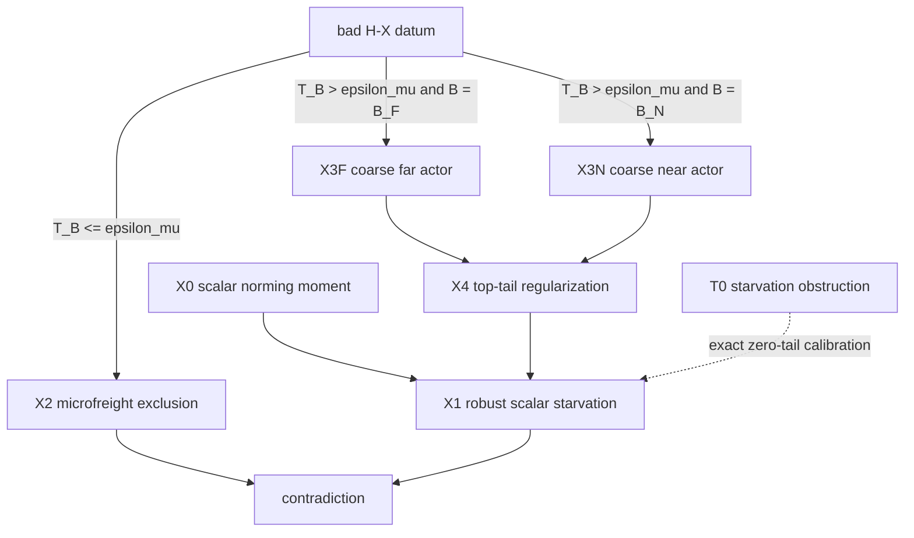

# W60 decomposition strategy — T0 to the H-X cell

This is a strategy artifact only.  Every new node below has proposed status
`conjecture`; no statement is promoted, and no proof of H-X is claimed.  All new
contracts live in the exact **signed** picture, with
\(\delta=\delta(P)\) and \(\tau=\sqrt\delta\); there is no signed-to-stochastic
crossing inside this brief.

## 0. Binding-gap verdict

**The pinned-tableau / same-carrier gap is binding.**  H-X gives positive
row-\(f\) freight through an arbitrary legal vertex kernel, whereas T0 is a
row-\(v\) full-fiber ledger around prescribed actors \(v,w,f,z,o\); no existing
registry result turns the former into the latter, supplies a row or row-hull
point \(z\) at scale \(\tau\), or aligns the freight carrier with the top-row
coefficient measure.  By contrast, the rank and slab restrictions appear
removable by one intrinsic change of observable: pair \(D=p_z-p_v\) with an
\(\ell^1\)-norming affine functional, which gives a scalar unit reproduction
moment in every rank and a global \(O(1/\tau)\) lever bound without a
two-coordinate slab.  The zero-top hypothesis can then be weakened to an
\(O(\delta)\) bound on positive top mass in the high-lever tail.  Thus proving a
same-carrier actor selection from H-X would reduce the other three named gaps to
short scalar ledgers, while proving rank/slab variants without such a selector
would still leave no edge out of `def-selected-corner`.  This assessment is
consistent with the W55 carrier-coincidence obstruction, the W56
one-hard-leaf wall, and the honest limits of
`lem-starvation-completion-obstruction`.

## 1. The tree

### Shared clone-quotient notation

Call \(\mathcal C=(P,v,\phi,h,f,\xi,B)\) a **bad H-X datum** when it is a
selected-corner configuration in the sense of `def-selected-corner`,
\(B\in\{B_F,B_N\}\), \(\Gamma_f(B)\ge1/4\), and \(M_X(B)>1/8\).
Let \(K(P)=\operatorname{conv}\{p_i\}\) be the row polytope and let \(Q\)
always denote a full equal-row fiber.  Put

\[
 c_Q:=\sum_{j\in Q}P_{vj},\qquad
 \mathsf T_B(\mathcal C):=
 \int_{B\cap\{p_x\ne p_u\}}
 \min\!\left\{1,\frac{\lVert p_x-p_u\rVert_1}{\tau}\right\}
 \,d\Gamma_f(x,u).
\]

The positive part \((c_Q)_+\) below is taken **after** full-fiber aggregation.
For a row-hull point \(q\in K(P)\), set \(s=\lVert q-p_v\rVert_1\) and

\[
 \mathcal N(v,q):=\left\{\chi:\begin{array}{l}
 \chi\text{ is affine on }K(P),\ \chi(p_v)=0,\ \chi(q)=1,\\[-2mm]
 |\chi(a)-\chi(b)|\le s^{-1}\lVert a-b\rVert_1
 \text{ for all }a,b\in K(P)
 \end{array}\right\}.
\]

For finite \(K\ge0\), define the actor-scaffold set

\[
 \mathfrak A_K(P,v,f):=
 \left\{(A,q):\begin{array}{l}
 A\ge4,\ q\in K(P),\ \tfrac12\tau\le
 \lVert q-p_v\rVert_1\le2\tau,\\[-1mm]
 \lVert p_f-p_v+A(q-p_v)\rVert_1\le K\delta
 \end{array}\right\},
\]

and, for \(\chi\in\mathcal N(v,q)\), define the full-fiber positive top tail

\[
 \operatorname{Tail}_L(v,\chi):=
 \sum_{Q:\,|\chi(p_Q)|>L}(c_Q)_+.
\]

All of these quantities are invariant under clone splitting: they use row
points, row-hull points, full-fiber aggregates, and a measure on the row-point
quotient.  In particular, \(\mathsf T_B\) is a one-step quotient transport
cost, not an index-level path product.

The dotted T0 arrow records an exact endpoint and proof template, not a claim
that T0's present contract logically implies the robust node X1.

The intended new-node dependency order is acyclic:
X0 precedes X1 and X4; X2, X3F, and X3N have only existing registry inputs;
and no node depends on one of its assembly consumers.  The X3F/X3N-to-X4 and
X4-to-X1 arrows are statement interfaces used by the final conjunction, not
back-edges in a shard proof.  The workspace snapshot has no generated
`argument/DAG.md`, so this check is against the intended `deps` listed below.

### X0 — `conj-w60-norming-moment`

**(a) Pinned contract.**  Proposed metadata: `status: conjecture`;
`picture: signed delta`; intended `defs: def-signed-idempotent`; intended
`deps:` none.

> For every finite exact signed idempotent \(P\), every \(q_0,q_1\in K(P)\) with \(s=\lVert q_1-q_0\rVert_1>0\), every full-fiber family \(d_Q=\sum_{j\in Q}(q_{1j}-q_{0j})\), and every \(\chi\in\operatorname{Aff}(K(P))\) with \(\chi(q_0)=0\), \(\chi(q_1)=1\), and \(\operatorname{Lip}_{\ell^1}(\chi)\le s^{-1}\), one has \(\sum_Qd_Q\chi(p_Q)=1\).

**(b) Mechanism sketch.**  The contract is the affine reproduction identity;
separately, \(\ell^1/\ell^\infty\) Hahn--Banach guarantees that its norming
class is nonempty by choosing a norm-one linear \(L\) with
\(L(q_1-q_0)=s\), and restricting
\(L(\,\cdot-q_0)/s\) to the row hull.  Since every point of \(K(P)\) is fixed
by \(P\), \((q_1-q_0)P=q_1-q_0\); applying **any** affine \(\chi\) with the
two pinned endpoint values after grouping by full fibers gives the scalar
moment.  This is the rank-free version of Claim 2 in
`lem-starvation-completion-obstruction`.

**(c) Honest price.**  Difficulty: **routine**.  The likeliest death is a
wording error between the ambient norm and the intrinsic row-hull Lipschitz
constant, not a mathematical counterexample.  Evidence is T0's unit moment and
`lem-harmonic-affine-bridge`; neither currently states this row-hull form.

**(d) Interface check.**  X0 gives the unit moment for **every** member of
\(\mathcal N(v,q)\), so the tail-good \(\chi\) selected by X4 is
the same \(\chi\) consumed by X1.
There is no rank reduction, coordinate projection, simplex chart, or choice of
individual indices.  The moment groups \(q_1-q_0\) over full fibers, so clone
multiplicity disappears before the equality is read.

**(e) Fallback.**  If the intrinsic Lipschitz formulation is awkward, state the
same universal endpoint-moment identity for restrictions of ambient affine
functionals; Hahn--Banach normer existence remains a separate routine
construction, not a second conclusion of this node.

### X1 — `conj-w60-robust-norming-starvation`

**(a) Pinned contract.**  Proposed metadata: `status: conjecture`;
`picture: signed delta`; intended
`defs: def-signed-idempotent; def-negative-mass`; intended
`deps: conj-w60-norming-moment; lem-mass-split`.

> For every finite \(K_R,L,K_C\ge0\) there exists a universal \(\delta_R(K_R,L,K_C)\in(0,2^{-16}]\) such that no finite exact signed idempotent \(P\) with \(0<\delta(P)\le\delta_R(K_R,L,K_C)\) admits full row-point fibers represented by \(v,f\), a pair \((A,q)\in\mathfrak A_{K_R}(P,v,f)\), and \(\chi\in\mathcal N(v,q)\) with \(\operatorname{Tail}_L(v,\chi)\le K_C\delta(P)\).

**(b) Mechanism sketch.**  Put \(D=q-p_v\) and
\(d_Q=\sum_{j\in Q}D_j\).  X0 gives
\(\sum_Qd_Q\chi(p_Q)=1\).  On the tail, split the full fibers by the sign of
\(d_Q\).  The synthetic row \(q\), being a convex combination of rows of
\(P\), obeys \(qP=q\), \(q\mathbf1=1\), and
\(\nu(q)\le\delta\), so \(-\delta\le q(S)\le1+\delta\) for every coordinate
subset \(S\).  For \(d_Q<0\), its lower subset budget
and the positive \(v\)-row top tail give
\(\sum|d_Q|\le(K_C+1)\delta\).  For \(d_Q>0\), write
\(p_f=p_v-AD+r\), with \(\lVert r\rVert_1\le K_R\delta\), and use the
lower subset budget of row \(f\) to get
\(\sum d_Q\le(K_C+K_R+1)\delta/A\).  The core costs at most
\(L\lVert D\rVert_1=O(\tau)\), while the row-diameter lever
\(|\chi|\le(2+4\delta)/\lVert D\rVert_1=O(1/\tau)\) makes the tail cost
\(O(\delta/\tau)=O(\tau)\), contradicting the unit moment below a universal
ceiling.  More explicitly, the candidate close is
\[
 1\le \tau\!\left[2L+2(2+4\delta)
 \left(K_C+1+\frac{K_C+K_R+1}{4}\right)\right],
\]
after using \(\tau/2\le\lVert D\rVert_1\le2\tau\).  The tool is the T0
two-sign-union ledger, scalarized rather than extended in coordinates.

**(c) Honest price.**  Difficulty: **routine**.  The likeliest death is a missed
sign in the positive-\(d\) union or an internal-fiber cancellation not covered
by the chosen aggregate; this is directly checkable by a short hostile algebra
pass.  T0 is exact calibration: in its display take \(q=p_z\), so
\(\lVert p_f-p_v+A(q-p_v)\rVert_1
=\delta\lVert p_o-p_v\rVert_1<3\delta\).  For every
\(\chi\in\mathcal N(v,p_z)\), the only positive top fibers are \(v,w\), with
\(\chi(p_v)=0\) and \(|\chi(p_w)|<1\), while \(c_f=-\delta\) and every other
\(c_Q=0\); hence T0 lies in the fixed calibration
\((K_R,L,K_C)=(3,1,0)\).
The W59 audit also records that several exact actor coefficient pins are unused.

**(d) Interface check.**  X1 consumes precisely the actor residual supplied by
X3F/X3N and the tail cap supplied by X4.  Its quantifier order is important:
\((K_R,L,K_C)\) are fixed first, then X1 supplies \(\delta_R\).  It is
rank-free, slab-free, and uses only full-fiber sign unions; \(q\) is a
row-polytope point fixed by \(P\), not an illicit projected matrix.  Thus there
is no frame-specific-to-frame-free step.

**(e) Fallback.**  First target the fixed subcase
\((K_R,L,K_C)=(3,1,0)\), which contains T0's residual and is already
rank-free and slab-free; the exact-residual case \(K_R=0\) is only a smaller
toy.  If one sign union fails, split X1 into separate positive-\(d\) and
negative-\(d\) tail lemmas rather than hiding the failed sign inside a larger
node.

### X2 — `conj-w60-hx-microfreight-exclusion`

**(a) Pinned contract.**  Proposed metadata: `status: conjecture`;
`picture: signed delta`; intended
`defs: def-selected-corner`; intended
`deps: lem-affine-barycenter-identity; lem-harmonic-affine-bridge`.

> There exist universal \(\epsilon_\mu\in(0,1/16)\) and \(\delta_\mu\in(0,2^{-16}]\) such that no bad H-X datum \(\mathcal C\) with \(\delta(P)\le\delta_\mu\) satisfies \(\mathsf T_B(\mathcal C)\le\epsilon_\mu\).

**(b) Mechanism sketch.**  Work in an exact quotient factorization of the
retraction and compare it to the legal kernel by a new coupling; do **not**
identify the arbitrary \(\xi\) with a coordinate matrix in that factorization,
and do not read \(\Gamma_f=P_{fx}^+\xi_x(u)\) as a transition/path product.
Constant positive row-\(f\)
mass on genuinely nonvertex source fibers at only
\(O(\epsilon_\mu\tau)\) conditional truncated vertex-transport length should
force an incoming full-fiber coefficient that
the \(O(\tau^2)\) row negativity cannot finance.  The proposed tool is a
Farkas/LP dual certificate for the exact left-inverse identities, with the
transport cost as its normalized objective.  This is a local thin-freight
problem, not a class-count problem.

**(c) Honest price.**  Difficulty: **creative-hard**.  The likeliest death is
that no dimension-free comparison exists between an arbitrary legal \(\xi\)
and any exact \(BL=I\) factorization—the DC4 chart/kernel mismatch in a new
guise; a thin nonclone transient-row graft carrying constant incoming mass
while its vertex displacement tends to zero is the concrete refuter shape.
The thin-blocker record
`obs-thin-zero-face-blocker-graft`, the W49/W50 tightness wall, and W56's
censoring death certificate are adverse evidence; no banked microfreight
exclusion exists.

**(d) Interface check.**  Equality \(\mathsf T_B=\epsilon_\mu\) belongs to X2;
the strict complement is routed to X3F or X3N.  The contract is universal over
the given \(\phi,h,f,\xi,B\), as named H-X requires.  It uses a total
row-point transport integral, never a mass floor for one pair or a bound on the
number of quotient classes.

**(e) Fallback.**  The exact surviving coarse weakening is: there are universal
\(\epsilon_\mu,\delta_\mu>0\) for which no bad H-X datum with
\(\delta(P)\le\delta_\mu\) and \(\mathsf T_B>\epsilon_\mu\) exists; its
unresolved residual is precisely the named `H-X-micro` cell
\(\mathsf T_B\le\epsilon_\mu\).  Alternatively aim at the existential-kernel
selector weakening in Section 2; neither fallback is named H-X.

### X3F — `conj-w60-hx-far-actor-selection`

**(a) Pinned contract.**  Proposed metadata: `status: conjecture`;
`picture: signed delta`; intended
`defs: def-selected-corner`; intended
`deps: lem-affine-barycenter-identity; lem-harmonic-affine-bridge; lem-sl1a-corner-ledger`.

> For every \(\epsilon>0\) there exist universal \(K_F(\epsilon)\in[0,\infty)\) and \(\delta_F(\epsilon)\in(0,2^{-16}]\) such that every bad H-X datum \(\mathcal C\) with \(B=B_F\), \(\delta(P)\le\delta_F(\epsilon)\), and \(\mathsf T_B(\mathcal C)>\epsilon\) satisfies \(\mathfrak A_{K_F(\epsilon)}(P,v,f)\ne\varnothing\).

**(b) Mechanism sketch.**  Reweight the full off-diagonal freight measure by
its truncated transport length and select a **synthetic row-hull actor** \(q\),
not a single pair.  A compactness-free finite Farkas alternative should say
that, after lifting \(b=A(q-p_v)\) and fixing one of a constant number of
scale slices for \(\lVert q-p_v\rVert_1/\tau\), either the weighted quotient displacements yield
\(p_f-p_v=-A(q-p_v)+O(\delta)\) at \(\lVert q-p_v\rVert_1\asymp\tau\), or one
gauge/tangent-cone separator violates the far-cell corner score.  Averaging is over the
freight coupling only; \(h\), \(\phi\), and hiddenness witnesses are held
fixed.

**(c) Honest price.**  Difficulty: **creative-hard**.  The likeliest death is
directional cancellation: a large transport cost can have a small signed
barycenter, and the barycenter can re-enter the W54 convex cylinder.  The
W57/W58 actor families and T0 are positive calibration only; they are not
evidence for this universal selector.

**(d) Interface check.**  The output is exactly the actor-scaffold hypothesis
of X4 and uses the same selected \(v,f\), which makes the W55 same-carrier issue
explicit rather than assumed.  A row-hull point \(q\) is clone-invariant and
already fixed by \(P\); no rank-three quotient matrix is asserted.  No
individual freight atom receives a quantitative floor.

**(e) Fallback.**  Output a probability distribution of actor scaffolds with
average residual \(O(\delta)\), then formulate an averaged scalar version of
X1; if the separating alternative has two signs, split X3F into two signed
far-actor cells.

### X3N — `conj-w60-hx-near-actor-selection`

**(a) Pinned contract.**  Proposed metadata: `status: conjecture`;
`picture: signed delta`; intended
`defs: def-selected-corner`; intended
`deps: lem-affine-barycenter-identity; lem-harmonic-affine-bridge; lem-sl1a-corner-ledger`.

> For every \(\epsilon>0\) there exist universal \(K_N(\epsilon)\in[0,\infty)\) and \(\delta_N(\epsilon)\in(0,2^{-16}]\) such that every bad H-X datum \(\mathcal C\) with \(B=B_N\), \(\delta(P)\le\delta_N(\epsilon)\), and \(\mathsf T_B(\mathcal C)>\epsilon\) satisfies \(\mathfrak A_{K_N(\epsilon)}(P,v,f)\ne\varnothing\).

**(b) Mechanism sketch.**  Use the exact barycentric identities
\(p_x=\sum_u\xi_x(u)p_u\).  Coarse freight into vertex coordinates lying
within \(4\tau\) of \(v\) forces compensating vertex barycenter outside the
near radial horn; combine that compensation once with row-\(f\) reproduction
to obtain a synthetic \(q\) at scale \(\tau\).  The intended proof tool is a
scale-sliced, lifted two-marginal Farkas alternative, not a direct separation
of the nonconvex \((A,q)\)-set and not a second-generation web recursion; only
the legal barycenter equality is used, never an identification \(\xi=L\) in a
matrix factorization.

**(c) Honest price.**  Difficulty: **creative-hard**.  The likeliest death is
that the compensating mass lives on the wrong carrier or outside the corner,
which is precisely the W55 carrier-coincidence obstruction.  The exact
barycenter identity is evidence for compensation, but there is no existing
registry result that turns it into the required \(O(\delta)\) actor residual.

**(d) Interface check.**  X3N has the same output type as X3F, so X4 and X1 are
radial-cell agnostic.  The strict radial convention is preserved:
\(B_N\) owns \(\lVert p_u-p_v\rVert_1<4\tau\), while equality remains in X3F.
All measures are on the quotient, and no independently generated corner is
asked to finance the selected carrier.

**(e) Fallback.**  Split the compensating target by top deficit and exposer
value, producing two explicitly named near-horn subcells; do not recurse from
the new carrier, because W56 has already killed that move.

### X4 — `conj-w60-hx-top-tail-regularization`

**(a) Pinned contract.**  Proposed metadata: `status: conjecture`;
`picture: signed delta`; intended
`defs: def-selected-corner`; intended
`deps: conj-w60-norming-moment; lem-mass-split; lem-harmonic-affine-bridge`.

> For every finite \(K\ge0\) there exist universal \(K'(K),C(K)\in[0,\infty)\), \(L(K)\in(0,\infty)\), and \(\delta_T(K)\in(0,2^{-16}]\) such that every bad H-X datum \(\mathcal C\) with \(\delta(P)\le\delta_T(K)\) and \(\mathfrak A_K(P,v,f)\ne\varnothing\) admits \((A,q)\in\mathfrak A_{K'(K)}(P,v,f)\) and \(\chi\in\mathcal N(v,q)\) with \(\operatorname{Tail}_{L(K)}(v,\chi)\le C(K)\delta(P)\).

**(b) Mechanism sketch.**  Minimize, on the finite row-point quotient and its
polyhedral hull, an actor residual plus a hinge penalty for positive row-\(v\)
mass at high norming leverage.  Use two thresholds: a bound
\(\sum_Q(c_Q)_+(|\chi(p_Q)|-L_0)_+\le C_0\delta\), with \(L_0>0\), gives
\(\operatorname{Tail}_{2L_0}\le(C_0/L_0)\delta\), which has exactly the
contract's form.  The admissible proof must use a global Farkas dual; if
phrased as a first variation, the direction must separate the entire feasible
face rather than certify one swap.  It must consume the exact identities
\(P^2=P\) at the same \(v,f,q\): if every
normer has a large tail, row-\(v\) reproduction and its \(O(\delta)\) negative
mass should expose a descent direction or a second actor with a smaller
penalty.  This is the quantitative replacement for fiberwise zero-top.

**(c) Honest price.**  Difficulty: **creative-hard**.  The likeliest death is
equal cancellation between opposite high-lever tails, leaving no legal first
variation at the norming face.  W42's optimal-face hard stop, W53's affine
pairing blind spot, and `obs-realized-alpha-blowup` are adverse structural
evidence; T0 supplies only the zero-tail endpoint.

**(d) Interface check.**  X4 fixes \(K\) first and outputs finite constants
that X1 can consume in that order.  Its objective depends only on the row hull,
full-fiber \(c_Q\), and affine normers, so clone splitting and harmless
zero-column transient extensions do not change it.  Common localization is
not treated as coefficient overlap: the missing overlap is exactly what this
node must prove using exact reproduction.

**(e) Fallback.**  Retain a named `H-X-high-top-tail` cell, or split the tail by
the sign of \(\chi\) and allow two actor scaffolds; if the first variation
cannot be written, kill this node rather than replacing it by coefficient-only
LP cleanup.

## 2. The assembly implication

### Quantifiers and ceilings

Assume all six main-tree nodes X0, X1, X2, X3F, X3N, and X4.  Let X2 first provide
\((\epsilon_\mu,\delta_\mu)\).  Invoke X3F and X3N at that already-fixed
\(\epsilon_\mu\), obtaining

\[
 K_F:=K_F(\epsilon_\mu),\quad K_N:=K_N(\epsilon_\mu),\quad
 K_*:=\max\{K_F,K_N\},
\]

and ceilings \(\delta_F(\epsilon_\mu)\),
\(\delta_N(\epsilon_\mu)\).  Invoke X4 at \(K_*\), obtaining
\(K':=K'(K_*)\), \(L:=L(K_*)\), \(C:=C(K_*)\), and
\(\delta_T(K_*)\).  Finally invoke X1 at the fixed triple \((K',L,C)\),
obtaining \(\delta_R(K',L,C)\).  Define

\[
 \delta_X:=\min\left\{
 2^{-16},\delta_\mu,\delta_F(\epsilon_\mu),
 \delta_N(\epsilon_\mu),\delta_T(K_*),\delta_R(K',L,C)
 \right\}>0.
\]

Suppose, toward contradiction, that the negation of
`conj-sl1a-off-diagonal-cell` occurs at \(0<\delta(P)\le\delta_X\), and retain
its actual arbitrary choices \((P,v,\phi,h,f,\xi,B)\).  This is a bad H-X
datum in the notation above.

1. If \(\mathsf T_B\le\epsilon_\mu\), X2 contradicts the datum; equality is
   deliberately owned by this branch.
2. If \(\mathsf T_B>\epsilon_\mu\), then the already-selected block is exactly
   one of \(B_F,B_N\).  X3F in the far case or X3N in the near case supplies
   an actor in \(\mathfrak A_{K_F}\) or \(\mathfrak A_{K_N}\), hence in
   \(\mathfrak A_{K_*}\).
3. X4 supplies \((A,q)\in\mathfrak A_{K'}\) and
   \(\chi\in\mathcal N(v,q)\) with
   \(\operatorname{Tail}_L(v,\chi)\le C\delta(P)\).
4. X0 is the rank-free unit-moment input to X1, and X1 at the fixed triple
   \((K',L,C)\) excludes exactly the data in step 3.

The two transport cases and two radial cases are disjoint and exhaustive, so
the assumed datum cannot exist.  This is the exact statement-level implication

\[
 \text{X0 + X1 + X2 + X3F + X3N + X4}
 \quad\Longrightarrow\quad
 \texttt{conj-sl1a-off-diagonal-cell}.
\]

The af-validated T0 anchor `lem-starvation-completion-obstruction` is the exact
rank-three, slab-confined, zero-tail calibration contained in X1's proposed
regime; it verifies that the scalar resource being generalized is genuine, but
its current contract alone does not supply X1.  Thus T0 is a rigorous anchor,
not a silently claimed logical bridge.  Existing proved shards
`lem-affine-barycenter-identity`, `lem-harmonic-affine-bridge`,
`lem-mass-split`, `lem-top-deficit-price`, and `lem-sl1a-corner-ledger` are the
listed local inputs; none crosses to the stochastic picture.

Downstream, if the still-conjectural H-I and H-D contracts also hold, then the
proved conditional `lem-sl1a-three-cell-reduction` gives SL1a with ceiling
\(\min\{2^{-16},\delta_X,\delta_I,\delta_D\}\).  Nothing here consumes
`lem-huddle-charge-assembly`: its own body carries a hostile
`INVALID AS STATED / DO NOT CONSUME` verdict, so this brief does not claim a
completed H-X-to-Kernel or H-X-to-`op-classical` chain.

### Exact route-sufficient fallback weaker than named H-X

If universality over \(\xi,B\) is where X2 or X4 dies, the following named
weakening still feeds the existing three-cell proof.  It is an exact fallback
contract, not an additional proposed registry node in the six-node tree, and
would remain conjectural if pursued:

A **pre-corner tuple** means a tuple \((P,v,\phi,h,f)\) satisfying exactly the
clauses of `def-selected-corner` after deleting its disintegration-kernel
clause; \(\xi\), \(C_f\), and \(B_F,B_N\) are then formed only after a legal
kernel is chosen.

> **H-X-selector (signed picture, proposed `conjecture`).** There exists a universal \(\delta_{\rm sel}\in(0,2^{-16}]\) such that every pre-corner tuple \((P,v,\phi,h,f)\) with \(\delta(P)\le\delta_{\rm sel}\) admits a legal vertex kernel \(\xi\) and a block \(B\in\{B_F,B_N\}\) with \(\Gamma_f(B)\ge1/4\) and \(M_X(B)\le1/8\).

For that chosen \(\xi,B\), the diagonal mass is at least \(1/8\).  The
universal H-I contract excludes \(M_I\ge1/16\); otherwise
\(M_D>1/16\), which H-D excludes.  Thus H-X-selector + H-I + H-D gives the same
SL1a contradiction at ceiling
\(\min\{2^{-16},\delta_{\rm sel},\delta_I,\delta_D\}\).  What remains from this weakening to named H-X is exactly
the universal-choice upgrade for every legal kernel and every qualifying
block; no such upgrade is being assumed here.  Because the literal front
matter of `lem-sl1a-three-cell-reduction` names universal H-X, consuming this
fallback would require a one-line selector-version assembly shard (or the
direct four-sentence reproof above); it is not an already-present DAG edge.

## 3. Kill-list check

### Node-by-node audit

- **X0:** passes only in its scalar form.  The tempting variant “project onto
  \(\operatorname{span}\{D,E\}\) and apply rank-three T0” is killed: an affine
  projection does not produce a square exact signed idempotent with controlled
  \(\delta\).  X0 uses no chart, path product, class count, or raw index.

- **X1:** passes because it uses two global full-fiber sign unions and one
  scalar moment.  A per-fiber payment would re-enter the class-count wall and
  is killed.  A freight-row Schur complement would invoke
  `lem-censoring-exactness` without \(\lVert A\rVert<1\) and is killed.  X1
  neither calls its coefficients transition probabilities nor confuses T0's
  five-point convex actor hull with `def-actor-hull`'s \(K_T,K_O\).

- **X2:** survives only as a genuine exact-factorization problem.  Any proposed
  proof by censoring thin freight rows, generic spectral gap, hitting-time
  sensitivity, or a lower bound on one pair's distance is killed by FINDINGS.
  A thin transient graft is its registered likely refuter, not something to be
  removed by minimality.

- **X3F:** passes because it averages a normalized quotient freight measure and
  outputs a row-hull actor.  Averaging top functionals or hiddenness witnesses
  is killed by W54, and Jensen alone is killed by the earlier selector
  certificates.  The contract therefore requires a Farkas separating
  alternative that consumes the fixed score; if the proof reduces to
  barycenter-in-a-convex-cylinder, kill X3F.

- **X3N:** passes only with same-carrier row-\(f\) reproduction.  A
  second-generation L-C recursion, far-side maximum principle, or the claim
  that independently generated corners finance the same carrier is killed by
  W56/W55.  Its radial equality convention matches `def-selected-corner`.

- **X4:** is not lexicographic \((V,R)\) minimality, an arbitrary max-volume
  tie selector, a single-swap argument, or coefficient-only support cleanup.
  Its continuous quotient objective has an explicit required consumer: an
  exact-reproduction first variation.  If that variation cannot be written,
  X4 is killed.  It also makes no bounded-\(\alpha\), exposer-transfer, or
  common-localization-implies-overlap assumption.

### W56 wall

The free split X2 versus coarse freight does not feed one residual hard lemma.
Its terminal mechanisms are distinct: exact thin-freight factorization (X2),
far-cell affine separation (X3F), near-cell barycentric compensation (X3N),
top-tail coefficient regularization (X4), and the scalar sign-union close (X1).
Each hard leaf carries a proper quantitative subclass or outputs a
constant-complexity scalar package.  No leaf retains the full H-X counterexample
class after selector/kernel/partition bookkeeping, so the W56
one-hard-leaf-after-free-preprocessing certificate is not being re-walked.

### Variants killed before entering the tree

1. An individual off-diagonal pair with
   \(\lVert p_x-p_u\rVert_1\gtrsim\tau\): H-X gives no norm gap; X2 owns the
   missing microfreight case.
2. Choosing an optimal exposer and declaring its value to be the slab
   coordinate: this may help the existential H-X-selector fallback, but named
   H-X quantifies over arbitrary admissible \(h\), including nonoptimal choices.
3. Exact W55 coefficient pins from common corner localization: W55 explicitly
   killed localization \(\Rightarrow\) coefficient overlap; X4 names the
   required same-carrier coupling instead.
4. Lex-minimal deletion of transient rows: W56 killed it, and X2 treats
   transient thin freight as a possible refuter.
5. Unnormalized sums over freight classes or a bound on their number: cloning
   and the quotient-packing wall kill both; every aggregate here is normalized
   or a full-fiber total.

## 4. Recommended dispatch order

1. **Batch X0 and X1 first.**  They are routine, algebraic, independently
   hostile-checkable, and may delete the rank and slab gaps while replacing
   exact zero-top by the explicit top-tail interface in one short wave.  X1 should be checked symbolically at the T0 endpoint and on
   arbitrary full-fiber sign patterns before any geometric work is funded.

2. **Run X2 as the first creative decider.**  Search exact factorized
   transient-graft families while a separate prover attempts the quotient
   Farkas certificate.  A family with \(\delta_k\to0\), bad H-X data, and
   \(\mathsf T_B\to0\) kills X2 and materially changes the target toward
   H-X-selector or a fourth micro cell.

3. **Run X3F and X3N in parallel.**  They have the same output interface but
   different geometry.  X3N is slightly higher priority because the kernel
   barycentric compensation is explicit there; X3F is the cleaner affine
   separation experiment.  Neither should wait for X4.

4. **Dispatch X4 last.**  It is the final creative-hard regularizer.
   X3F/X3N are the binding pinned-tableau selectors; X4 is the
   final zero-top/top-tail regularizer.  Give X4 the actual constants and actor
   output produced by whichever selector survives; otherwise its optimization
   domain is too unscoped and risks becoming the W56 residual restatement.

Routine batch: **X0, X1**.  Parallel creative batch: **X2, X3F, X3N** (with X2
as the decisive prove-or-refute lane).  Serial creative finisher: **X4**.
