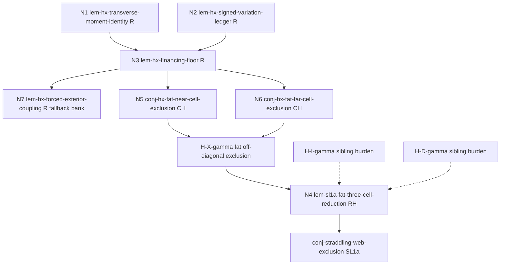

<!--
ROLE: W60 strategy deliverable (Fable strategist, independent of the other W60 strategist).
STATUS DISCIPLINE (L0): a STRATEGY SKETCH. Promotes nothing. Every proposed node is
`conjecture` (or "proposed-lemma shape") until proved by the standard prover/verifier
pipeline. All derivations shown inline are PLAUSIBILITY arguments for pricing, not proofs.
PICTURE: signed throughout (exact signed idempotent, delta(P), tau = sqrt(delta)) unless
explicitly stated otherwise.
-->

# DECOMPOSITION-W60 (Fable) — the T0 anchor -> H-X gap, decomposed

Target: `conj-sl1a-off-diagonal-cell` (H-X). Anchor: `lem-starvation-completion-obstruction`
(T0, af-validated), full proof `context/PAPER-PROOF-w59.md`. Objective function: DECOMPOSITION
into lower-complexity pieces; no one-shot proof is attempted or claimed.

---

## 0. Binding-gap verdict

**Verdict: gap 4 (the pinned tableau) is the *nominal* binding gap, but on analysis it
dissolves almost entirely, and the residual hard content is gap 3 (fiberwise zero-top /
starvation budgets), generalized to a two-row positive-mass CONFINEMENT question. Gaps 1
(rank) and 2 (slab) are dischargeable this wave by routine lemmas.**

The argument, in four steps, each checkable against the T0 proof text:

1. **The moment identity needs neither rank 3 nor a basis (gap 1 discharged).** The W59
   proof derives the unit transverse moment (its eq. (3)–(5)) by expanding rows in the
   basis (p_v, D, E) — the only place rank 3 enters the moment side. But the identity has
   a basis-free form: for ANY two rows r,s of an exact signed idempotent, D := p_r − p_s
   is left-fixed (subtract two rows of P² = P), i.e. D = Σ_j D_j p_j; applying ANY affine
   ψ whose linear part L has L(D) = 1, and using Σ_j D_j = 0 (both rows sum to 1), gives
   Σ_Q ψ(p_Q) d_Q = 1 over full row-point fibers Q, with d_Q the Q-fiber sums of D. No
   rank hypothesis, no coordinate uniqueness, no pin. (The W59 hostile verifier's
   honest-limits audit already observed the identity itself survives rank > 3; what it
   said fails is the LEVER estimate — see step 2.)

2. **The lever bound needs no slab (gap 2 discharged).** The W59 proof uses the canonical
   slab 0 ≤ Y_Q ≤ 1 to make the p_v,p_o combination convex in its eq. (9)–(10). Basis-free,
   the lever bound is free: take the recentred sign functional
   ψ_c(y) := Σ_j sgn(D_j)(y_j − c_j)/‖D‖₁ for any center c. Then L(D) = 1 and
   |ψ_c(p_Q)| ≤ ‖p_Q − c‖₁/‖D‖₁ for every fiber — i.e. the lever of a fiber is its
   ℓ1-distance from c in units of ‖D‖₁. Metric balls around any center are automatically
   low-lever sets; the global lever cap (2+4δ)/‖D‖₁ is the row-diameter bound. The slab
   hypothesis was only ever a coordinate-chart way of saying "exterior fibers are metrically
   controlled"; the recentred sign functional says it intrinsically, at every rank.

3. **The pins relax to a window (the removable half of gap 4).** The exact pin
   ‖p_z−p_v‖₁ = τ and A ∈ [4,6] enter the T0 close only through two scale requirements:
   the low-lever (actor-hull) fibers must contribute A·‖D‖₁ = o(1) to the unit moment, and
   the exterior budget O(δ) must satisfy O(δ)/‖D‖₁ = o(1) after multiplication by the
   global lever. Both hold for ANY transverse pair with ‖D‖₁ in a window
   (K·δ, c/A] — the exact τ is immaterial. The W59 verifier's Finding 2 (the coefficient
   pins c_v = 1−τ, c_w = τ+t, c_f = −t are UNUSED) already showed the display is
   over-pinned; the window observation removes the metric pin too. What the window does
   NOT remove: freight pairs at displacement below the window (nearly-diagonal freight),
   which no moment argument on that pair can see — handled below by a surface
   renegotiation (fat diagonal), not by a proof.

4. **What is left is exactly gap 3, generalized.** After steps 1–3 the whole T0 mechanism
   compresses to one inequality (node N3 below): two rows at ℓ1-distance ℓ must JOINTLY
   ship ≥ (1−Aℓ)/Λ − 2δ positive coefficient mass onto high-lever fibers. The T0 gadget
   closed because its hypotheses (zero-top exteriors + the pinned finance rows f,o) made
   the supply provably O(δ) ≪ demand. In H-X nothing pins the supply: the open content is
   to prove that the specific rows the corner hands us (v, f, the freight rows x, and the
   carriers u) do NOT ship enough positive mass into the high-lever region. That is a
   confinement/starvation statement — gap 3 with the pin removed — and it is recognizably
   the program's standing λ-vs-P⁺ / affine-pairing blind spot (FINDINGS 2026-07-09 W53)
   now given a QUANTITATIVE demand side by the engine. Resolving the surface this way is
   the largest unscoped-surface reduction available: three routine lemmas retire gaps 1
   and 2 outright, one interface lemma retires the pin, and the campaign's diffuse
   "generalize the tableau" item becomes two sharply-scoped confinement conjectures with
   explicit constants to fight.

---

## 1. The tree

Seven nodes. N1–N3 are the engine bank (routine, proposed-lemma shapes). N4 is the surface
renegotiation (routine-hard). N5–N6 are the hard leaves (conjectures). N7 is the routine
strategic byproduct/fallback. Statuses: all `conjecture`/proposed until proved; nothing here
promotes anything.

Notation used in all contracts: P a finite exact signed idempotent (SIGNED picture);
p_i its i-th row point; full row-point fibers Q partition the index set I by p_i = p_j;
for a set S of fibers, P_i^+(S) := Σ_{Q∈S} Σ_{j∈Q} max(P_{ij},0); ν_i = row-i negative
mass; δ = δ(P), τ = √δ; d_Q := Σ_{j∈Q}(P_{rj} − P_{sj}) for an ordered row pair (r,s).
All of these are full-fiber / affine / ℓ1 quantities, hence clone-invariant.

### Implication sketch

R = routine, RH = routine-hard, CH = creative-hard. Dashed = sibling-owned burden, named
exactly in §2. T0 anchor `lem-starvation-completion-obstruction` is not a dep of any node
(its MECHANISM is generalized, its statement is not consumed); it remains the exact-case
sanity fixture every node must reproduce.

---

### N1 — `lem-hx-transverse-moment-identity` (routine)

**(a) Contract (signed picture).** For every finite exact signed idempotent P, every
ordered pair of row indices (r,s) with D := p_r − p_s, and every affine ψ: R^I → R whose
linear part L satisfies L(D) = 1, the full row-point fibers satisfy
Σ_Q ψ(p_Q)·d_Q = 1, where d_Q := Σ_{j∈Q}(P_{rj} − P_{sj}).

**(b) Mechanism.** Subtracting rows r and s of P² = P gives Σ_k D_k p_k = D (D is a
left-fixed vector); apply L: L(D) = Σ_k D_k L(p_k) = Σ_k D_k ψ(p_k) (the affine constant
dies against Σ_k D_k = 0, both rows summing to 1); group the finite sum by fibers
(ψ(p_Q) constant on a fiber). Tool: linear algebra on P² = P — the W59 Claim 2 verbatim,
freed from its basis. Rank-free, pin-free, basis-free.

**(c) Honest price.** Routine (near-mechanical). Likeliest death: none mathematical; a
hostile verifier may demand the one-line display D = Σ_k D_k p_k and the Σ D_k = 0 step
be explicit. Evidence: W59 Claim 2 (T0) is the rank-3 special case; the W59 verifier's
honest-limits audit states the identity survives rank > 3 after basis extension — this
form needs no extension at all.

**(d) Interface check.** Universally quantified over (P, r, s, ψ); no existential
selector, no optimality, no argmin. d_Q and ψ(p_Q) are fiber-level quantities
(clone-invariant; clone splits re-sum inside fibers, as in the T0 clone audit). No index
path products. Signed picture; no stochastic crossing.

**(e) Fallback.** The rank-3 basis form (T0 Claim 2 verbatim) — loses the gap-1
discharge but keeps the rest of the tree alive at rank 3.

---

### N2 — `lem-hx-signed-variation-ledger` (routine)

**(a) Contract (signed picture).** For every finite exact signed idempotent P, every
ordered pair of row indices (r,s), and every set S of full row-point fibers,
Σ_{Q∈S}|d_Q| ≤ P_r^+(S) + P_s^+(S) + ν_r + ν_s.

**(b) Mechanism.** Partition S by the sign of the AGGREGATE d_Q; on the positive
sign-union S₊ (a genuine index subset): Σ d_Q = P_r(S₊) − P_s(S₊) ≤ P_r^+(S₊) + ν_s;
symmetrically on S₋. Tool: the W59 Claim 1 + Claim 4 sign-union pattern (each row budget
paid once per union, never per fiber — this is exactly what made W59 K-free).

**(c) Honest price.** Routine. Likeliest death: none plausible; boundary care for fibers
with d_Q = 0 (assign to S₊, they contribute nothing).

**(d) Interface check.** Universal; full-fiber sums and index-level positive parts
grouped by fibers — clone-invariant. This is the BUDGET CONVERTER: it reduces "exterior
d-variation" (the T0 proof's Claim 4 objects) to "positive mass the two rows place on S"
— which is what makes the confinement question (N5/N6) the honest residual.

**(e) Fallback.** The global bound Σ_Q|d_Q| ≤ ‖D‖₁ (triangle inequality under grouping;
common knowledge) — no localization, engine still runs but with F-term budget ‖D‖₁,
which is vacuous.

---

### N3 — `lem-hx-financing-floor` (routine; deps: N1, N2) — THE ENGINE

**(a) Contract (signed picture).** For every finite exact signed idempotent P, every
ordered pair of row indices (r,s) with ℓ := ‖p_r − p_s‖₁ > 0, every affine ψ whose
linear part L satisfies L(p_r − p_s) = 1, all reals A, Λ > 0, and every set N of full
row-point fibers such that |ψ(p_Q)| ≤ A for every Q ∈ N and |ψ(p_Q)| ≤ Λ for every
Q ∉ N, the complement F of N satisfies
P_r^+(F) + P_s^+(F) ≥ (1 − Aℓ)/Λ − ν_r − ν_s.

**(b) Mechanism.** Split the N1 identity over N ∪ F:
1 ≤ A·Σ_N|d_Q| + Λ·Σ_F|d_Q| ≤ A·ℓ + Λ·(P_r^+(F) + P_s^+(F) + ν_r + ν_s),
using Σ_Q|d_Q| ≤ ‖D‖₁ = ℓ (grouping decreases ℓ1 variation; common knowledge) on the
N-term and N2 on the F-term; rearrange. Tool: arithmetic assembly of N1 + N2.
**Default instantiation (in the shard body, not the contract):** ψ = the recentred sign
functional ψ_c(y) = Σ_j sgn(D_j)(y_j − c_j)/ℓ for any center c; then
|ψ_c(p_Q)| ≤ ‖p_Q − c‖₁/ℓ, so N = {fibers within ℓ1-distance Aℓ of c} qualifies with
Λ = (2+4δ)/ℓ whenever c lies in the row-point hull (row diameter ≤ 2+4δ). Reading: **two
rows at separation ℓ must jointly finance ≈ (1−Aℓ)·ℓ/(2+4δ) positive mass OUTSIDE every
ball of radius Aℓ.** The T0 lemma is the special case: r,s = the gadget rows z,v; N = the
actor hull (A ≤ 6, via canonical coordinates); Λ = (2+4t)/τ (via the slab); supply pinned
to O(δ) by zero-top + finance rows; (1−6τ)τ/(2+4t)-type demand unfinanceable — the
45/1024 < 1 close.

**(c) Honest price.** Routine. Likeliest death: none for validity; the real risk is
SCOPE (the floor is vacuous when Aℓ ≥ 1 or Λ ≥ (1−Aℓ)/(2δ)) — a usage note, not a
defect. Verification criterion: re-derive the T0 close (19)–(21) from this contract as
the fixture.

**(d) Interface check.** Universal over all inputs; the consumer chooses (r,s,ψ,N,A,Λ)
— choices are explicit constructions, not selectors with tie-breaking (dodges the
exists-exact-max-volume dead route). All quantities clone-invariant as in N1/N2. Signed.

**(e) Fallback.** None needed; if a verifier rejects the two-parameter (A,Λ) form,
retreat to the ball-instantiated corollary (= N7's shape) as the only banked form.

---

### N4 — `lem-sl1a-fat-three-cell-reduction` (routine-hard; the gap-4 renegotiation)

**(a) Contract (signed picture).** With γ := √δ(P)/4: if there exist universal
δ_X^γ, δ_I^γ, δ_D^γ ∈ (0, 2^{-16}] such that (i) no selected-corner configuration
(def-selected-corner) with δ(P) ≤ δ_X^γ has a block B ∈ {B_F,B_N} with Γ_f(B) ≥ 1/4 and
M_X^γ(B) > 1/8, (ii) none with δ(P) ≤ δ_I^γ has Γ_f(B) ≥ 1/4, M_X^γ(B) ≤ 1/8, and
M_I^γ(B) ≥ 1/16, and (iii) none with δ(P) ≤ δ_D^γ has Γ_f(B) ≥ 1/4, M_X^γ(B) ≤ 1/8,
M_I^γ(B) < 1/16, and M_D^γ(B) > 1/16 — where M_X^γ(B) := Γ_f{(x,u) ∈ B : ‖p_x−p_u‖₁ > γ}
and M_I^γ/M_D^γ split Γ_f{(x,u) ∈ B : ‖p_x−p_u‖₁ ≤ γ} by the carrier type
K_T(u) ∩ K_O(u) ≠ ∅ / = ∅ — then the SL1a contract of `conj-straddling-web-exclusion`
holds with δ₀ = min(2^{-16}, δ_X^γ, δ_I^γ, δ_D^γ).

**(b) Mechanism.** Verbatim re-run of the proved `lem-sl1a-three-cell-reduction`: its
proof uses the diagonal predicate p_x = p_u ONLY as a classification of pairs (the
selection of φ, h, f, ξ, the corner ledger ≥ 1/2, the radial horn ≥ 1/4, and the
1/8–1/16–1/16 arithmetic are predicate-agnostic); replacing "p_x = p_u" by
"‖p_x − p_u‖₁ ≤ γ" (boundary γ owned by the diagonal) still partitions B into three
guarded, exhaustive, disjoint cells, and the same three-case contradiction closes. Tool:
partition bookkeeping over an already-hostile-verified proof skeleton.

**(c) Honest price.** Routine-hard (no new mathematics, but a full re-verification pass;
the fat cells need a small definition shard, e.g. an addendum to def-selected-corner).
Likeliest death: NOT this lemma — the exported burden: H-I^γ/H-D^γ are STRICTLY STRONGER
than the registered H-I/H-D (their diagonal cells now include source points x within
γ = τ/4 of the carrier u instead of exactly at it). If the sibling mechanisms (carrier
K_T/K_O type analysis, zero-face capacity kills) cannot absorb a quarter-ρ source shift,
γ must shrink; at γ = δ^{3/4} the sibling burden is sub-scale (≈ free) but N5/N6 must
then additionally kill the displacement band (δ^{3/4}, τ/4], where the engine's demand
ℓ/(2+4δ) sits BELOW the banked leak allowances (see N5(c)) — the band is exactly the
constants no-man's-land. γ is therefore a NEGOTIABLE DIAL, and fixing it requires
sibling-owner + user sign-off (this changes the SL1a surface; registered as NEW shards
alongside the W56 ones, per the stop conditions — nothing is edited or retired
unilaterally).

**(d) Interface check.** The three fat cells partition Γ_f(B) exactly (displacement
trichotomy exhaustive; ‖p_x−p_u‖₁ = γ owned by diagonal; type I/D total on carriers by
`lem-always-tight-dual-support` nonemptiness, as in the W56 proof). The conclusion is the
UNCHANGED SL1a contract — the weakening lives entirely in the premise cells and is
exactly named: what remains open besides N5/N6 is H-I^γ and H-D^γ (sibling waves), i.e.
"H-I/H-D with sources γ-close to carriers". Quantifiers: identical routing to the W56
reduction (existence of one legal tuple; exclusion of every tuple). Fat masses are
Γ_f-masses of ℓ1-displacement-defined pair sets: clone-invariant. Signed.

**(e) Fallback.** γ = δ^{3/4} variant (sibling burden ≈ free; band burden moves to
N5/N6); if BOTH γ endpoints die, the fat route is abandoned and the nearly-diagonal
regime becomes a named open sub-conjecture of H-X (honest residual, still smaller than
H-X).

---

### N5 — `conj-hx-fat-near-cell-exclusion` (creative-hard)

**(a) Contract (signed picture).** There exists a universal δ_XN ∈ (0, 2^{-16}] such
that no selected-corner configuration (def-selected-corner) with δ(P) ≤ δ_XN has
Γ_f(B_N) ≥ 1/4 and M_X^γ(B_N) > 1/8, where γ = √δ(P)/4.

**(b) Mechanism sketch.** Every counted pair (x,u) has u within 4τ of v and
ℓ = ‖p_x−p_u‖₁ > τ/4. Two sub-regimes with separate mechanisms (the internal case
structure, to be split into sub-shards by the prover, not funneled):
(i) ℓ > 8τ: then ‖p_x − p_v‖₁ ≥ ℓ − 4τ ≥ ℓ/2 — run the engine N3 on the pair (x, v)
with center c = p_v. v's confinement is BANKED: positive v-mass at z ≥ 4τ is
≤ δ(2+4δ)/(4τ) (lem-top-deficit-price), and at h ≥ 4τ is ≤ ν_v/(4τ) (h-reproduction at
v via lem-harmonic-affine-bridge + sign split), total leak ≲ 3τ/4; so the demand
transfers to x alone, and the ≥ 1/8 freight of such x is aggregated through row f by the
exact two-step identity P² = P at f (P_f(F) = Σ_x P_fx P_x(F), a matrix identity, not a
flow interpretation) against the corner ledger (`lem-sl1a-corner-ledger`: f ships > 1/2
INTO the corner, so ≤ 1/2 + ν_f is available outside).
(ii) τ/4 < ℓ ≤ 8τ: huddle-internal freight (all points within ~12τ of v). Here the
engine demand ~ ℓ/(2+4δ) ≤ 4τ sits at or below the banked leak allowances — the engine
alone cannot close, and per the W53 blind spot no row-reproduction/affine pairing can:
this sub-case MUST consume hiddenness/zero-face structure of the near carriers u
(t*(u) < κ via `lem-hiddenness-dual-witness` small-β form, and/or the zero-face capacity
kills), the same mandate the W25 insufficiency certificate imposed on step 4. Candidate
extra budgets, in order: the 1/13 margin in the corner score 2z(p_f)/D + h(p_f) ≤ 12τ/13
(unexploited); per-center optimization of the N3 floor (the floor holds for EVERY center
c — choose c adversarially against the leak); hiddenness of u coupling its far
positive mass to exposer-failure witnesses.

**(c) Honest price.** Creative-hard. Likeliest death: THE CONSTANTS FIGHT — the z/h
ledgers cap v's leak at ~3τ/4 while the per-pair demand is only ~ℓ/(2+4δ); for ℓ ≲ 2τ
the demand is BELOW the permitted leak, and x and u have NO banked confinement at all,
so the aggregation through f currently falls short by a constant factor
(1/8 · demand vs f's ≤ 1/2 exterior budget). Evidence this is the true wall shape: the
identical demand-vs-leak constants fight killed naive step-4 until hiddenness was
consumed (W25, FINDINGS 2026-07-06), and W53 certifies that heavy ρ-near huddles evade
all affine-pairing prices. Evidence FOR provability: in every certified true-hidden
construction the near cluster folds back before depth 4τ (W29 frontier) and no huddle
with the needed leak structure has ever been realized (L3, no emptiness claim).

**(d) Interface check.** Universal over configurations with B = B_N (the block is part
of the quantified datum, matching the registered H-X form). M_X^γ ≤ M_X, so N5 is
formally WEAKER than the B_N-restriction of registered H-X — exactly compensated in N4.
No t*-division (W54 discipline); no kernel marginal read as transition mass (the
two-step identity is coefficient algebra); all masses full-fiber; ℓ1 displacements on
row points. Clone-invariant. Signed.

**(e) Fallback.** If (ii) dies: shrink γ (band moves here from N4's dial — no help) OR
re-fatten AROUND v (classify pairs with ‖p_u − p_v‖₁ < 4τ and ‖p_x − p_v‖₁ ≤ 12τ as
"v-diagonal", exporting a strengthened near-diagonal burden to H-I^γ/H-D^γ at v — a
second, explicitly named renegotiation requiring sibling sign-off). If (i) also dies:
bank N7 and retarget the wave at the forced-coupling program (§N7 role); H-X reverts to
open with the surface honestly reduced by the engine bank.

---

### N6 — `conj-hx-fat-far-cell-exclusion` (creative-hard)

**(a) Contract (signed picture).** There exists a universal δ_XF ∈ (0, 2^{-16}] such
that no selected-corner configuration (def-selected-corner) with δ(P) ≤ δ_XF has
Γ_f(B_F) ≥ 1/4 and M_X^γ(B_F) > 1/8, where γ = √δ(P)/4.

**(b) Mechanism sketch.** Counted pairs have carrier u ρ-far from v, co-top
(z(p_u) < 4τ ⇒ d_u > H − 4τ), hidden with 0 < t*(u) < κ (corner-ledger consequence +
`lem-positive-exposedness-margin`) — the straddling web itself, with x a NON-vertex
corner point at displacement ℓ > τ/4 from u. Attack stack: (1) engine N3 on (x,u) with
center p_u, and in parallel on (f,v) — note f itself lies IN the corner region
K := {z < 4τ, h < 4τ} (its score inequality forces z(p_f) ≤ 6Dτ/13 < 4τ,
h(p_f) ≤ 12τ/13·... < 4τ), so any ψ flat on K has spread ≥ 1 across each pair in K,
forcing A ≥ 1/2 — the honest reading: EITHER the corner region is not ψ-flattenable in
the pair direction (a thickness alternative with its own geometry), OR the pair rows leak
Ω(ℓ) positive mass OUTSIDE K. (2) The leak targets are then co-top-distant (z ≥ 4τ) or
high-exposer (h ≥ 4τ) fibers, and the confinement fight is: u's z-reproduction allows a
z-leak of mass ~4τ/Z at level Z (too weak alone — the detection gap), so the close must
couple u's hiddenness: financing mass at high lever is ρ-far from u and must sit low in
u's admissible exposers, which is exactly what the small-β dual witness
(`lem-hiddenness-dual-witness`, W53 normalization) and `lem-always-tight-dual-support`
constrain. This is the quantitative form of the W54 mutual-exposure-rigidity intuition:
the engine supplies, for the first time, an Ω(ℓ) DEMAND that the mutually-far hidden
family must finance somewhere no banked ledger permits cheaply.

**(c) Honest price.** Creative-hard. Likeliest death: THE DETECTION GAP — the corner
functionals (z, h) price the far/financing region only at the demand scale (supply
allowance ~ τ·D/4 vs demand ~ ℓ/(2+4δ): same order), and deep fibers (z ~ Ω(1), near
C_W) are priced by NO banked ledger at better than that scale, so the adversary can
formally finance via τ-mass deep leaks; worse, the hiddenness coupling runs through
UPPER bounds on t*-objects and the W37 dual-direction wall says hiddenness cannot be run
backward through upper bounds. Evidence for the node anyway: the demand is new (no
prior wave had a lower bound to fight the leaks against), the 1/13 score margin and the
per-center freedom of the floor are unexploited dials, and the whole certified record
(W49F) contains NO in-class tall instance — the class being fought has never been
realized.

**(d) Interface check.** As N5 with B = B_F; same clone-invariance, quantifier, and
picture discipline. The thickness alternative in (b) must be stated inside the eventual
proof as a case split with an exhaustiveness clause, NOT as a silent assumption
(pre-registered here to keep the prover honest).

**(e) Fallback.** Bank the (f,v)-pair and (x,u)-pair instances of N7 as far-cell
structure lemmas ("fat far freight forces Ω(ℓ) exterior feeding by named rows"), and
name the residual confinement inequality as the single open successor conjecture in
sketch v25 — still a strict surface reduction (four diffuse gaps → one named
inequality). Do NOT fall back to a one-hard-leaf restatement (W56 wall).

---

### N7 — `lem-hx-forced-exterior-coupling` (routine; deps: N3; the strategic byproduct)

**(a) Contract (signed picture).** For every finite exact signed idempotent P, every
pair of row indices (r,s), and every point c in the convex hull of the row points of P,
the full row-point fibers Q with ‖p_Q − c‖₁ > 1/2 carry joint positive coefficient mass
P_r^+ + P_s^+ at least ‖p_r − p_s‖₁/(2(2+4δ(P))) − 2δ(P).

**(b) Mechanism.** N3 with the recentred sign functional ψ_c and A·ℓ = 1/2 (ball radius
1/2), Λ ≤ (2+4δ)/ℓ. Tool: instantiation. Sanity anchor (include as fixture): at δ = 0
this is the quantitative shadow of block disjointness — two mixture rows at separation ℓ
must ship ≥ ℓ/4-ish mass to the recurrent fibers, which are ℓ1-spread by disjoint
supports; checked by hand on the two-block stochastic idempotent family (tight up to
constants at extreme mixtures).

**(c) Honest price.** Routine. Likeliest death: none for validity; the risk is
TRIVIALITY — verification criterion: it must say something non-vacuous on the W29/W35
certified frontier instances (to be checked numerically in the wave, L3).

**(d) Interface check.** Universal; ball centers quantified (no selector); full-fiber
masses; signed picture; clone-invariant. NOT part of the H-X assembly — it is the
demand-side λ-vs-P⁺ coupling banked as a standalone fact family ("exact idempotence
forces long-range positive financing proportional to row separation"), which is the
missing DIRECTION (a forced lower bound on far positive mass) behind
`conj-cotop-web-coupling` (L6.5) and the whole W37/W38 coupling wall. If N5/N6 die, this
is the wave's guaranteed take-home and the recommended pivot target.

**(e) Fallback.** n/a (it IS the fallback).

---

## 2. The assembly implication, in full

Claimed chain (statement-level, every link named):

1. **N1 ∧ N2 ⇒ N3** — pure arithmetic: split the N1 identity over N/F, bound the N-term
   by A·Σ_Q|d_Q| ≤ A·ℓ (grouping ≤ ‖D‖₁, common knowledge), bound the F-term by
   Λ·(N2 with S = F), rearrange. Quantifier hygiene: N3's inputs (ψ, N, A, Λ) are
   universally quantified hypotheses; N1/N2 are invoked at exactly those inputs. No gap.

2. **N3 ⇒ N7** — instantiation at ψ = ψ_c, N = {‖p_Q − c‖₁ ≤ 1/2}, A = 1/(2ℓ),
   Λ = (2+4δ)/ℓ; the Λ-bound needs c in the row hull (row diameter ≤ 2+4δ from
   ‖p_i‖₁ ≤ 1+2ν_i, the W59 Claim 1 ledger — re-proved inside N2's shard or cited as
   common row geometry). No gap.

3. **N5 ∧ N6 ⇒ H-X^γ** — the fat off-diagonal exclusion: a configuration violating
   H-X^γ has a block B ∈ {B_F, B_N} with Γ_f(B) ≥ 1/4 and M_X^γ(B) > 1/8; B = B_N
   contradicts N5, B = B_F contradicts N6; the two cases are exhaustive because the
   block in the selected-corner datum is by definition one of the two (radial partition,
   `lem-radial-horn-partition` fixes boundary ownership). δ_X^γ := min(δ_XN, δ_XF). No
   gap; note this two-case assembly is itself trivial enough to live inside N4's proof
   or as a two-line shard — I do not spend a node on it.

4. **H-X^γ ∧ H-I^γ ∧ H-D^γ ⇒ SL1a** — this is N4, whose proof is the W56 reduction
   skeleton with the fat classification predicate. The three fat cells partition Γ_f(B)
   (displacement trichotomy + carrier-type totality via `lem-always-tight-dual-support`);
   the 1/4 → 1/8 → 1/16 → 1/16 arithmetic and boundary ownership are unchanged; the
   consumed proved deps are the same five as `lem-sl1a-three-cell-reduction`
   (lem-top-deficit-price, lem-harmonic-affine-bridge, lem-mass-split,
   lem-positive-exposedness-margin, lem-always-tight-dual-support). The conclusion is
   the verbatim SL1a contract of `conj-straddling-web-exclusion`.

**What this route does and does not deliver for the registered H-X.** It does NOT prove
`conj-sl1a-off-diagonal-cell` as registered: H-X^γ is strictly weaker (M_X^γ ≤ M_X). It
delivers SL1a through a RENEGOTIATED three-cell surface — the explicitly named weakening
the brief permits. Exactly what remains open after this tree: **H-I^γ and H-D^γ** (the
sibling cells with sources up to γ = τ/4 from their carriers — sibling-owned waves, with
the γ-dial fallback to δ^{3/4} if quarter-ρ shifts break their mechanisms), plus N5 and
N6 themselves. Registry actions if adopted: register N1–N3, N7 as proposed lemmas;
register N4 + a fat-cells definition addendum + H-I^γ/H-D^γ as new conjecture shards
ALONGSIDE the W56 surface (nothing retired; the original reduction stays valid and
unconsumed); DAG stays acyclic (N4 deps point at fat cells; fat cells dep on nothing new;
no back-edges into H-X).

**DAG/deps summary.** N1: deps none. N2: deps none. N3: deps N1, N2. N7: deps N3.
N5: deps N3, lem-sl1a-corner-ledger, lem-top-deficit-price, lem-harmonic-affine-bridge,
lem-hiddenness-dual-witness (mandated hiddenness input), lem-radial-horn-partition.
N6: deps N3, lem-sl1a-corner-ledger, lem-top-deficit-price, lem-always-tight-dual-support,
lem-hiddenness-dual-witness, lem-positive-exposedness-margin.
N4: deps H-X^γ (= N5∧N6 assembly), H-I^γ, H-D^γ (new conjecture shards) + the five W56
reduction deps. All acyclic.

---

## 3. Kill-list check (node by node against FINDINGS dead routes + walls)

- **Raw-index path products / cloning obstruction:** every quantity in every contract is
  a full-fiber sum, an affine functional value on row points, or an ℓ1 distance; no
  index-level product anywhere. The N5 two-step identity P_f(F) = Σ_x P_fx P_x(F) is an
  exact matrix identity over fibers, not a path-product floor; its clone-invariance is
  inherited from fiber grouping (T0 clone-audit pattern). PASS.
- **W56 one-hard-leaf wall:** the two hard leaves N5/N6 each retain a strict SUB-class
  of H-X (per-cell × fat-displacement regime), and each is attacked with a mechanism
  that did not exist at W56 time (the engine's quantitative demand) — their residual
  content is a confinement inequality, not a restatement; deriving H-X back from either
  single leaf is impossible (each misses the other cell and the fat-diagonal regime).
  The fattening is not "free preprocessing with no consumer": the γ-threshold is
  consumed by the engine's window (N5/N6 need ℓ > γ) and by the sibling burden. PASS —
  but flagged: if a prover collapses N5 and N6 back into one leaf "because the
  mechanisms unified", that is the wall re-forming; stop and re-split.
- **Lex-(V,R) minimal-counterexample stratification:** not used anywhere. PASS.
- **Freight-row censoring without a norm gap:** not used; no censoring, no ‖A‖ < 1
  assumption. PASS.
- **Second-generation L-C recursion:** not used; N6's hiddenness coupling stays at the
  original carriers. PASS.
- **Max-principle far-side return:** not used; N5's aggregation goes through the exact
  two-step identity, not through sign-unconstrained ψ_u maximizers. PASS.
- **W54 witness-averaging / averaged-φ degeneracy:** no averaging of top functionals or
  witnesses anywhere; the only averaging is the banked corner ledger (consumed verbatim).
  PASS.
- **W54 t*-free discipline:** no contract or sketch divides by t*(u). PASS.
- **W55 deads (λ·P ≡ p_v identification; conic recurrence / thin-thick separator):** the
  kernel ξ's marginals are never identified with transition mass; ψ-coefficients are
  never transition weights (the T0 §MECHANISM discipline restated in N1/N3 notes). PASS.
- **Coefficient-only LP support-cleanup / pointwise selectors / Jensen / canonical-g
  energy / ψ-gap / finite-corner-as-asymptotic:** none invoked. PASS.
- **Zero-denominator NSC charging (DC1):** N2 charges the two chosen rows' positive
  masses plus their OWN ν's — never a carrier's ambient negativity alone. PASS.
- **W53 affine-pairing blind spot (a WALL, not a dead route):** honored, not dodged —
  N5(ii) and N6 explicitly carry the mandate that closure must consume hiddenness/
  zero-face structure; the engine is the demand side only. This is the declared
  likeliest-death of both hard nodes, priced in (c).
- **W37 dual-direction wall:** N6's likeliest death names it; any prover route running
  hiddenness backward through an upper bound must be rejected by the verifier.
- **Frame-specific → frame-free:** all statements are ambient-ℓ1/affine; no canonical
  simplex frame anywhere. Signed picture declared in every contract; no silent crossing
  to the stochastic picture (crossings, if ever needed, go through lem-classical-equiv —
  not needed in this tree). PASS.

---

## 4. Recommended dispatch order

1. **Dispatch 1 (routine batch, one prover + one batched hostile verifier, W56-validated
   pattern): N1 + N2 + N3 + N7.** Near-certain, small, af-elevation-shaped (single
   minimal contracts). Even in the worst case for the rest of the tree, this dispatch
   alone retires gap 1 and gap 2 of the W59 §HONEST LIMITS, de-pins the tableau metric,
   and banks the first forced-coupling lower bound (N7) — unconditional surface
   reduction. Include the T0-close re-derivation and a W29/W35-frontier non-vacuity
   check (L3) as fixtures.
2. **Dispatch 2 (routine-hard + decision memo): N4.** Prover re-runs the W56 reduction
   with the fat predicate at γ = τ/4; simultaneously a one-page memo to the user +
   sibling owners on the γ-dial (τ/4 vs δ^{3/4}) — this is a surface change and needs
   ratification before the sibling waves (H-I^γ/H-D^γ) are scoped.
3. **Dispatch 3 (L3 decider, cheap, before any creative spend): the leak-financing
   refuter.** Exact-rational search for a configuration financing the N3 demand through
   deep/high leaks at the N5(ii)/N6 constants (demand ~ ℓ/(2+4δ) vs leak allowances
   ~ 3τ/4): if a financing instance exists, the confinement constants are wrong and
   N5/N6 need restating BEFORE a prover burns on them; if the search fails against the
   banked frontier families, that is the standard (non-proof) green light. This is the
   repo's bounded prove-or-refute discipline applied to the priced death.
4. **Dispatch 4 (creative prover): N6 before N5.** N6 sits on the program's converged
   wall with the most banked partial machinery (dual witness, always-tight support,
   co-top pinning, the never-realized tall class) and the engine gives it a genuinely
   new demand to fight with; N5's huddle-internal band is the least-tooled regime (W53)
   and should go last, informed by whatever N6's fight teaches about consuming
   hiddenness against the detection gap.

Batchable routine: dispatches 1–2. Creative: dispatch 4 (and the N5 follow-on).
Decision points for the user: the γ-dial (dispatch 2) and any N5(e)/N6(e) fallback
adoption (surface changes).
